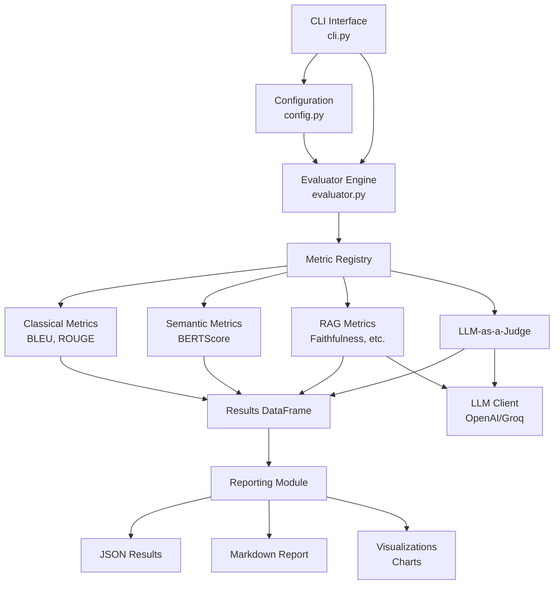
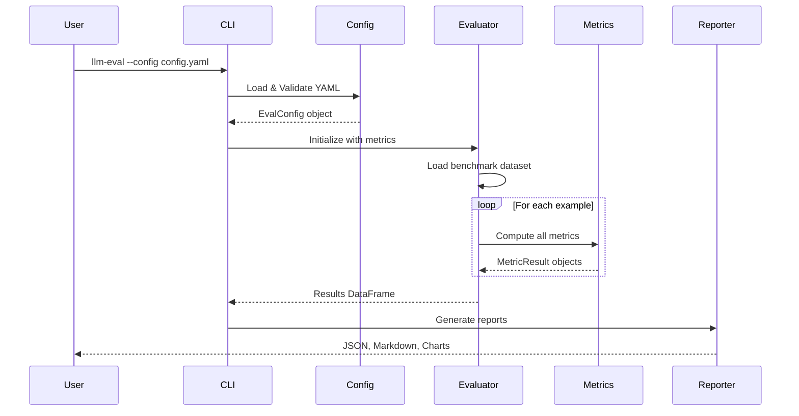

# LLM Evaluation Framework - Architecture

## 📐 System Overview

The LLM Evaluation Framework is designed as a **modular, extensible pipeline** for evaluating Large Language Model outputs using multiple metrics. The architecture follows **object-oriented principles** with clear separation of concerns, enabling easy maintenance and extension.



---

## 🏗️ Core Components

### 1. **CLI Layer** (`cli.py`)

**Purpose**: User-facing command-line interface

**Key Functions**:
- Parse command-line arguments (config path, output directory)
- Load and validate YAML configuration
- Initialize metric registry
- Orchestrate evaluation workflow
- Display results with Rich formatting

**Technologies**: Typer, Rich Console

---

### 2. **Configuration System** (`config.py`)

**Purpose**: Type-safe configuration management

**Key Classes**:
- `EvalConfig`: Main configuration model
  - `eval_name`: Evaluation identifier
  - `dataset_path`: Path to benchmark data
  - `metrics`: List of metrics to compute
  - `output_dir`: Results directory
  - `llm_judge`: Optional LLM judge configuration

- `LLMJudgeConfig`: LLM provider settings
  - `provider`: "openai" or "groq"
  - `model`: Model identifier
  - `dimensions`: Evaluation dimensions

**Technologies**: Pydantic (data validation)

---

### 3. **Evaluator Engine** (`evaluator.py`)

**Purpose**: Core evaluation orchestration

**Workflow**:
1. Load benchmark dataset (JSONL format)
2. For each example:
   - Extract query, response, reference, contexts
   - Compute all configured metrics
   - Aggregate results
3. Return pandas DataFrame with all scores

**Key Features**:
- Parallel metric computation (can be extended)
- Error handling for individual metric failures
- Progress tracking with tqdm

---

### 4. **Metric System** (`metrics/`)

All metrics inherit from `BaseMetric` abstract class:

```python
class BaseMetric(ABC):
    @abstractmethod
    def compute(self, query: str, response: str, 
                reference: Optional[str] = None, 
                contexts: Optional[List[str]] = None) -> MetricResult:
        pass
```

**Metric Types**:

#### Classical Metrics (`classical.py`)
- **BleuMetric**: N-gram overlap (NLTK)
- **RougeLMetric**: Longest common subsequence (rouge-score)

#### Semantic Metrics (`semantic.py`)
- **BERTScoreMetric**: Neural semantic similarity (bert-score)

#### RAG-Specific Metrics (`rag.py`)
- **FaithfulnessMetric**: Response grounding in context
- **ContextRelevancyMetric**: Context relevance to query
- **AnswerRelevancyMetric**: Response relevance to query

#### LLM-as-a-Judge (`judge.py`)
- **MultiDimensionalJudge**: Customizable evaluation dimensions
  - Uses structured prompts
  - JSON response parsing
  - Configurable dimensions (accuracy, clarity, completeness, etc.)

---

### 5. **LLM Client** (`utils/llm_client.py`)

**Purpose**: Unified interface for LLM providers

**Features**:
- Provider abstraction (OpenAI, Groq)
- API key management via environment variables
- Retry logic with exponential backoff (via tenacity)
- Temperature control
- Response parsing

**Supported Providers**:
- OpenAI (GPT-4, GPT-3.5)
- Groq (Llama 3.3, Mixtral)

---

### 6. **Reporting Module** (`reporting/`)

#### Markdown Generator (`markdown_gen.py`)
- Jinja2 templates for report generation
- Aggregate statistics (mean, std, min, max)
- Per-example score tables
- Markdown-formatted output

#### Visualizer (`visualizer.py`)
- **Radar Charts**: Multi-metric comparison (matplotlib)
- **Score Histograms**: Distribution analysis (seaborn)
- Customizable styling
- PNG output

---

## 📊 Data Flow



---

## 🔌 Extension Points

### Adding Custom Metrics

1. **Create metric class** inheriting from `BaseMetric`:

```python
# src/llm_eval/metrics/custom.py
from llm_eval.metrics.base import BaseMetric, MetricResult

class CustomMetric(BaseMetric):
    def compute(self, query, response, reference=None, contexts=None):
        # Your logic here
        score = self._calculate_score(response, reference)
        return MetricResult(name="Custom", score=score)
```

2. **Register in `cli.py`**:

```python
registry = {
    "bleu": BleuMetric(),
    "custom": CustomMetric(),  # Add here
    # ...
}
```

3. **Use in config**:

```yaml
metrics:
  - custom
```

---

### Adding LLM Providers

Extend `JudgeClient` in `utils/llm_client.py`:

```python
if self.provider == "anthropic":
    self.client = Anthropic(api_key=os.getenv("ANTHROPIC_API_KEY"))
```

---

## 🐳 Deployment Architecture

### Docker Setup

**Multi-stage Build**:
1. **Builder Stage**: UV-based dependency installation (10-100x faster than pip)
2. **Runtime Stage**: Minimal Python 3.13-slim image

**Benefits**:
- Reproducible environment
- Fast builds
- Small image size
- Security (non-root user)

**Docker Compose**:
- Health checks for service readiness
- Volume mounts for data and results
- Environment variable injection
- Network isolation

---

## 🔒 Design Patterns

### 1. **Factory Pattern**
Metric registry creates metric instances based on configuration strings.

### 2. **Strategy Pattern**
Each metric is a strategy implementing the `compute()` interface.

### 3. **Dependency Injection**
Metrics are injected into the Evaluator, enabling testability.

### 4. **Template Method**
Base metric class defines the contract, subclasses implement specifics.

---

## 📦 Project Structure

```
llm-eval-framework/
├── src/llm_eval/              # Main package
│   ├── __init__.py            # Package exports
│   ├── cli.py                 # CLI interface (Typer)
│   ├── config.py              # Configuration models (Pydantic)
│   ├── evaluator.py           # Evaluation engine
│   ├── metrics/               # Metric implementations
│   │   ├── __init__.py
│   │   ├── base.py            # Abstract base class
│   │   ├── classical.py       # BLEU, ROUGE
│   │   ├── semantic.py        # BERTScore
│   │   ├── rag.py             # RAG metrics
│   │   └── judge.py           # LLM-as-a-Judge
│   ├── reporting/             # Report generation
│   │   ├── __init__.py
│   │   ├── markdown_gen.py    # Markdown reports
│   │   └── visualizer.py      # Charts
│   └── utils/                 # Utilities
│       ├── __init__.py
│       └── llm_client.py      # LLM API client
│
├── tests/                     # Test suite (88% coverage)
├── benchmarks/                # Evaluation datasets
├── examples/                  # Example configurations
├── scripts/                   # Utility scripts
├── results/                   # Generated outputs
├── Dockerfile                 # Container definition
├── docker-compose.yml         # Orchestration
└── pyproject.toml             # Dependencies (Poetry)
```

---

## 🧪 Testing Strategy

### Unit Tests
- Individual metric implementations
- Configuration validation
- Utility functions

### Integration Tests
- End-to-end evaluation pipeline
- Report generation
- Multi-metric scenarios

### Mocking Strategy
- External LLM APIs mocked in tests
- File I/O operations mocked for CLI tests

**Coverage**: 88% (target: 80%)

---

## ⚡ Performance Considerations

### Current Optimizations
1. **UV Package Manager**: 10-100x faster Docker builds
2. **Batch Processing**: Metrics process examples in sequence (can be parallelized)
3. **Caching**: BERTScore caches model embeddings
4. **Lazy Loading**: Datasets loaded only when needed

### Future Optimizations
1. **Parallel Metric Computation**: Use `multiprocessing` for independent metrics
2. **GPU Acceleration**: Optional GPU support for BERTScore
3. **Streaming Evaluation**: Process large datasets in chunks
4. **Result Caching**: Cache metric results for repeated evaluations

---

## 🔐 Security

- API keys managed via environment variables (never committed)
- Docker container runs as non-root user
- .env.example provided (no secrets)
- Dependency pinning prevents supply chain attacks

---

## 📚 Technology Stack

| Component | Technology | Purpose |
|-----------|-----------|---------|
| CLI | Typer | Command-line interface |
| Config | Pydantic | Data validation |
| Data | Pandas | Tabular data handling |
| NLP | NLTK, rouge-score | Classical metrics |
| ML | Transformers, bert-score | Neural metrics |
| LLM | OpenAI, Groq | API integration |
| Viz | Matplotlib, Seaborn | Charts |
| Test | Pytest | Testing framework |
| Package | Poetry | Dependency management |
| Container | Docker | Deployment |

---

## 🎯 Design Principles

1. **Modularity**: Each component has a single responsibility
2. **Extensibility**: Easy to add new metrics without modifying core
3. **Testability**: Dependency injection enables comprehensive testing
4. **Type Safety**: Pydantic models ensure configuration validity
5. **Error Handling**: Graceful degradation when metrics fail
6. **Documentation**: Comprehensive docstrings and type hints

---

## 🔄 Future Enhancements

- [ ] Web UI for interactive evaluation
- [ ] Metric comparison across multiple models
- [ ] Custom prompt templates for LLM-as-a-Judge
- [ ] Integration with MLOps platforms (MLflow, Weights & Biases)
- [ ] Streaming evaluation for real-time monitoring
- [ ] A/B testing framework
- [ ] Batch evaluation API endpoint
- [ ] Support for more LLM providers (Anthropic, Cohere)
