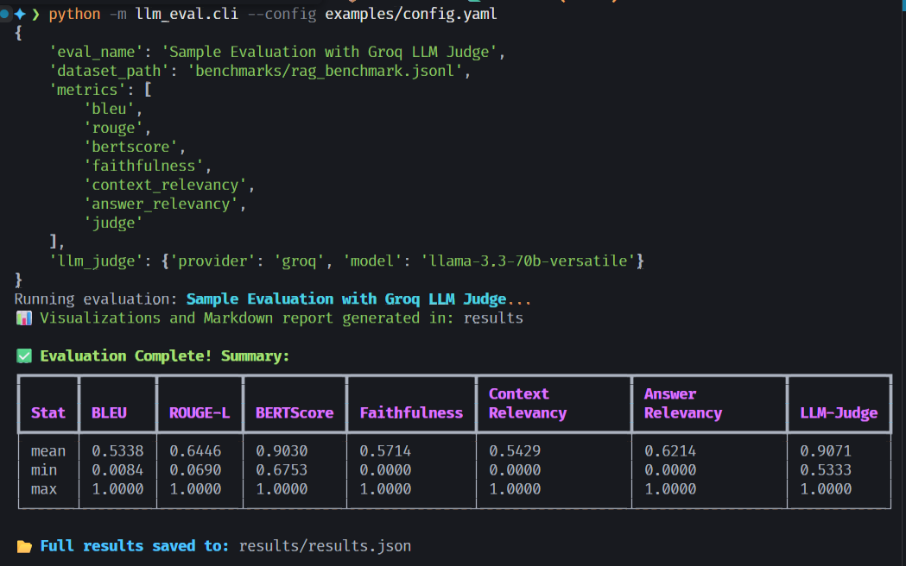
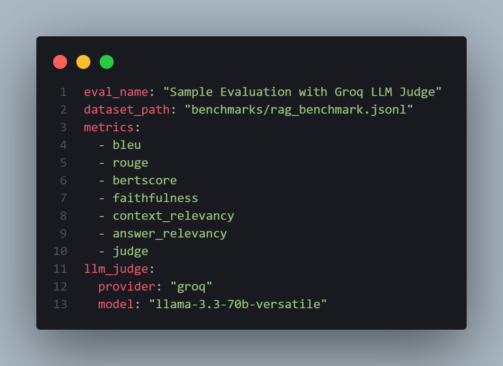

# 🚀 LLM Evaluation Framework

A production-grade framework for evaluating Large Language Model (LLM) responses using multiple metrics, including classical NLP metrics, semantic similarity, RAG-specific metrics, and LLM-as-a-Judge evaluations.

[](https://www.python.org/downloads/)
[](https://python-poetry.org/)
[](https://www.docker.com/)
[](https://github.com/features/actions)

## 📋 Overview

This framework provides a comprehensive suite of evaluation metrics for assessing LLM-generated responses. It's designed for researchers, ML engineers, and developers who need reliable, reproducible evaluation of language model outputs.

**Key Capabilities:**
- 🎯 **7 Built-in Metrics**: BLEU, ROUGE-L, BERTScore, Faithfulness, Context Relevancy, Answer Relevancy, Multi-dimensional Judge
- 📊 **Rich Reporting**: JSON results, markdown reports, radar charts, score histograms
- 🐳 **Fully Containerized**: Docker and docker-compose ready
- 🔄 **CI/CD Integrated**: GitHub Actions workflow with automated testing
- 🧪 **80%+ Test Coverage**: Comprehensive test suite with pytest
- ⚙️ **Flexible Configuration**: YAML-based configuration with Pydantic validation
- 🔌 **Multi-Provider Support**: OpenAI and Groq LLM providers
- 🎨 **Beautiful Visualizations**: matplotlib and seaborn charts

## ✨ Features

### Evaluation Metrics

#### Classical NLP Metrics
- **BLEU**: Bilingual Evaluation Understudy score for n-gram overlap
- **ROUGE-L**: Longest Common Subsequence-based recall metric

#### Semantic Metrics
- **BERTScore**: Neural similarity using BERT embeddings

#### RAG-Specific Metrics
- **Faithfulness**: How well the response is grounded in retrieved contexts
- **Context Relevancy**: How relevant retrieved contexts are to the query
- **Answer Relevancy**: How relevant the response is to the original query

#### LLM-as-a-Judge
- **Multi-dimensional Judge**: Customizable dimensions (accuracy, clarity, completeness, etc.)

### Reporting & Visualization
- 📄 **JSON Results**: Structured output for programmatic access
- 📝 **Markdown Reports**: Human-readable evaluation summaries
- 🎯 **Radar Charts**: Multi-metric performance visualization
- 📊 **Score Histograms**: Distribution analysis for each metric

## 🔧 Installation

### Prerequisites
- Python 3.13 or higher
- Poetry (for dependency management)
- Docker & docker-compose (optional, for containerized deployment)

### Using Poetry (Recommended)

```bash
# Clone the repository
git clone https://github.com/AkhileshMalthi/llm-eval-framework.git
cd llm-eval-framework

# Install dependencies
poetry install

# Run commands with poetry run (e.g., poetry run llm-eval)
```

### Using pip

```bash
# Clone the repository
git clone https://github.com/AkhileshMalthi/llm-eval-framework.git
cd llm-eval-framework

# Install dependencies
pip install -e .
```

### Using Docker

```bash
# Clone the repository
git clone https://github.com/AkhileshMalthi/llm-eval-framework.git
cd llm-eval-framework

# Build and run with docker-compose
docker-compose up
```

## 🚀 Quick Start

### 1. Set Up Your Environment

Create a `.env` file with your API keys:

```env
OPENAI_API_KEY=your_openai_key_here
GROQ_API_KEY=your_groq_key_here
```

### 2. Prepare Your Benchmark Data

Create a JSONL file with your evaluation data (see `benchmarks/rag_benchmark.jsonl` for format):

```jsonl
{"query": "What is Python?", "response": "Python is a programming language.", "expected_answer": "Python is a high-level programming language.", "retrieved_contexts": ["Python is a popular programming language."]}
{"query": "What is the capital of France?", "response": "Paris", "expected_answer": "Paris is the capital of France.", "retrieved_contexts": ["Paris is the capital city of France."]}
```

### 3. Configure Your Evaluation

Create a `config.yaml` file:

```yaml
eval_name: "My Evaluation"
dataset_path: "benchmarks/rag_benchmark.jsonl"

metrics:
  - bleu
  - rouge
  - bertscore
  - faithfulness
  - context_relevancy
  - answer_relevancy
  - judge

llm_judge:
  provider: "groq"  # or "openai"
  model: "llama-3.3-70b-versatile"  # or "gpt-4"
```

### 4. Run Evaluation

```bash
# Using Poetry
poetry run llm-eval --config examples/config.yaml

# Using installed CLI
llm-eval --config examples/config.yaml

# Using Docker
docker-compose run llm-eval llm-eval --config examples/config.yaml
```



### 5. View Results

Results are saved to the `results/` directory:
- `results.json`: Raw evaluation data
- `report.md`: Human-readable markdown report
- `radar_chart.png`: Multi-metric radar visualization
- `score_histograms.png`: Score distribution charts

## CLI in Action

*Example configuration file for evaluation*


*Running evaluation with the CLI - showing metrics computation and results*

## Usage

### Command-Line Interface

```bash
# Run with default config
llm-eval --config config.yaml

# Specify custom benchmark file
llm-eval --config config.yaml --benchmark benchmarks/custom.jsonl

# Specify custom output directory
llm-eval --config config.yaml --output results/experiment1
```

### Python API

```python
from llm_eval import Evaluator, EvalConfig

# Create configuration
config = EvalConfig(
    eval_name="My Evaluation",
    dataset_path="benchmarks/rag_benchmark.jsonl",
    metrics=["bleu", "rouge", "bertscore"]
)

# Run evaluation
evaluator = Evaluator(config)
results = evaluator.run()

# Generate reports
from llm_eval.reporting import generate_markdown_report, generate_radar_chart

generate_markdown_report(results, "results/report.md")
generate_radar_chart(results, "results/radar.png")
```

### Docker Workflow

```bash
# Build the container
docker-compose build

# Run evaluation
docker-compose up

# Run with custom config
docker-compose run llm-eval llm-eval --config /app/examples/custom_config.yaml

# Enter container for debugging
docker-compose run llm-eval bash
```

## 🏗️ Architecture

### Project Structure

```
llm-eval-framework/
├── src/llm_eval/           # Main package
│   ├── __init__.py         # Package exports
│   ├── cli.py              # Command-line interface
│   ├── config.py           # Configuration models
│   ├── evaluator.py        # Core evaluation engine
│   ├── metrics/            # Metric implementations
│   │   ├── base.py         # Base metric class
│   │   ├── classical.py    # BLEU, ROUGE
│   │   ├── semantic.py     # BERTScore
│   │   ├── rag.py          # RAG-specific metrics
│   │   └── judge.py        # LLM-as-a-Judge
│   ├── reporting/          # Report generation
│   │   ├── markdown_gen.py # Markdown reports
│   │   └── visualizer.py   # Charts and plots
│   └── utils/              # Utilities
│       └── llm_client.py   # LLM API client
├── tests/                  # Test suite (80%+ coverage)
├── benchmarks/             # Example benchmark data
├── examples/               # Example configurations
├── results/                # Evaluation outputs
├── Dockerfile              # Container definition
├── docker-compose.yml      # Service orchestration
├── pyproject.toml          # Dependencies and metadata
└── .github/workflows/      # CI/CD pipelines
```

### Metric System

All metrics inherit from `BaseMetric` and implement the `compute()` method:

```python
from llm_eval.metrics.base import BaseMetric, MetricResult

class CustomMetric(BaseMetric):
    def compute(self, query: str, response: str, 
                reference: str = None, contexts: list = None) -> MetricResult:
        # Your metric logic here
        score = self._calculate_score(response, reference)
        
        return MetricResult(
            name="Custom Metric",
            score=score,
            details={"additional_info": "value"}
        )
```

### Configuration System

Configuration is validated using Pydantic models:

```python
from llm_eval.config import EvalConfig, LLMJudgeConfig

config = EvalConfig(
    eval_name="My Evaluation",
    dataset_path="data.jsonl",
    metrics=["bleu", "rouge"],
    llm_judge=LLMJudgeConfig(
        provider="openai",
        model="gpt-4"
    )
)
```

## 🧩 Adding Custom Metrics

### 1. Create Your Metric Class

```python
# src/llm_eval/metrics/custom.py
from llm_eval.metrics.base import BaseMetric, MetricResult

class MyCustomMetric(BaseMetric):
    """Description of your metric."""
    
    def __init__(self, **kwargs):
        super().__init__()
        # Initialize any required resources
        
    def compute(self, query: str, response: str, 
                reference: str = None, contexts: list = None) -> MetricResult:
        """Compute your metric."""
        
        # Implement your metric logic
        score = self._your_calculation(response, reference)
        
        return MetricResult(
            name="My Custom Metric",
            score=score,
            details={"key": "value"}
        )
```

### 2. Register Your Metric

Add your metric to the registry in `src/llm_eval/evaluator.py`:

```python
from llm_eval.metrics.custom import MyCustomMetric

METRIC_REGISTRY = {
    "bleu": BLEUMetric,
    "rouge": ROUGEMetric,
    "my_custom": MyCustomMetric,  # Add your metric
    # ...
}
```

### 3. Use in Configuration

```yaml
metrics:
  - my_custom
  - bleu
  - rouge
```

## 🧪 Testing

The framework includes comprehensive tests with 80%+ coverage:

```bash
# Run all tests
poetry run pytest

# Run with coverage report
poetry run pytest --cov=src/llm_eval --cov-report=html

# Run specific test file
poetry run pytest tests/test_classical_metrics.py

# Run with verbose output
poetry run pytest -v
```

## 📊 Example Results

### Sample Evaluation Output

```json
{
  "query": "What is Python?",
  "response": "Python is a programming language.",
  "expected_answer": "Python is a high-level programming language.",
  "metrics": {
    "BLEU": {
      "score": 0.7532,
      "details": {}
    },
    "ROUGE-L": {
      "score": 0.8246,
      "details": {}
    },
    "BERTScore": {
      "score": 0.9134,
      "details": {}
    },
    "Faithfulness": {
      "score": 0.85,
      "details": {}
    }
  }
}
```

### Markdown Report Sample

```markdown
# LLM Evaluation Report

## Summary
- Total Examples: 28
- Average BLEU: 0.7234
- Average ROUGE-L: 0.7891
- Average BERTScore: 0.8923

## Detailed Results
| Query | BLEU | ROUGE-L | BERTScore |
|-------|------|---------|-----------|
| What is Python? | 0.75 | 0.82 | 0.91 |
| ... | ... | ... | ... |
```

## 🤝 Contributing

Contributions are welcome! Please follow these steps:

1. Fork the repository
2. Create a feature branch (`git checkout -b feature/amazing-feature`)
3. Make your changes
4. Add tests for new functionality
5. Ensure all tests pass (`poetry run pytest`)
6. Commit your changes (`git commit -m 'Add amazing feature'`)
7. Push to the branch (`git push origin feature/amazing-feature`)
8. Open a Pull Request

### Development Setup

```bash
# Install development dependencies
poetry install --with dev

# Run tests with coverage
poetry run pytest --cov=src/llm_eval

# Run linting
poetry run ruff check src/

# Format code
poetry run black src/
```

## 📄 License

This project is licensed under the MIT License - see the LICENSE file for details.

## 🙏 Acknowledgments

- [NLTK](https://www.nltk.org/) for BLEU implementation
- [rouge-score](https://github.com/google-research/google-research/tree/master/rouge) for ROUGE metrics
- [BERTScore](https://github.com/Tiiiger/bert_score) for semantic similarity
- [OpenAI](https://openai.com/) and [Groq](https://groq.com/) for LLM-as-a-Judge capabilities

## 📮 Contact & Support

- **Issues**: [GitHub Issues](https://github.com/AkhileshMalthi/llm-eval-framework/issues)
- **Discussions**: [GitHub Discussions](https://github.com/AkhileshMalthi/llm-eval-framework/discussions)
- **Email**: your.email@example.com

---

**Built with ❤️ for the ML community**

